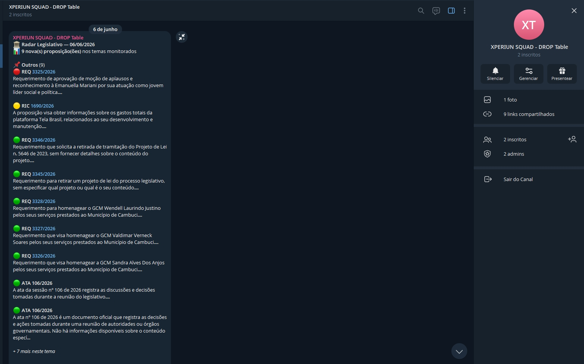

# 🏛️ Bússola Pública - Pipeline de Inteligência Governamental com IA

[](https://pandas.pydata.org/)
[](https://github.com/astral-sh/uv)
[](https://supabase.com/)
[](https://openai.com/)
[](https://parquet.apache.org/)

## 📝 Cenário de Negócio & Desafio

Este projeto consolida uma solução real de Engenharia de Dados desenvolvida para a **Bússola Pública**, uma consultoria de relações governamentais especializada em prover inteligência estratégica e analítica sobre o ecossistema legislativo brasileiro para clientes corporativos. 

**O Problema:** Originalmente, o monitoramento das atividades parlamentares, gastos de deputados e o teor de votações na Câmara era realizado através de processos manuais e planilhas descentralizadas. Esse formato gerava severo atraso na tomada de decisão, assimetria de informações, erros de categorização temática e impossibilidade de escala analítica.

**A Solução:** Um pipeline de dados robusto, resiliente e totalmente automatizado estruturado sob a **Arquitetura Medallion (Bronze/Raw → Silver → Gold)**. A solução extrai dados de deputados, partidos, despesas e votações direto da API da Câmara Federal, trata e tipaga as informações via Pandas, aplica Inteligência Artificial Cognitiva (Embeddings + LLM GPT-4o-mini) para categorização e geração de resumos executivos de negócios, otimiza o armazenamento analítico local em formato colunar Parquet e consolida o Data Warehouse na nuvem através do Supabase (PostgreSQL).

---

## 🏗️ Arquitetura da Solução e Fluxo de Dados

O ecossistema foi projetado utilizando práticas modernas de engenharia, estruturando o pipeline em camadas sequenciais de dados governadas por um orquestrador central (`main.py`):

1. **Camada Bronze (Raw Stage):** Ingestão isolada dos dados brutos em arquivos JSON diretamente da API pública da Câmara dos Deputados. Conta com políticas rigorosas de resiliência, incluindo *Retry Loops* com recuo de tempo (*backoff*) e timeouts estendidos para blindar o pipeline contra instabilidades de rede e erros de servidor (`504 Gateway Timeout`), garantindo a captura íntegra de mais de 5.000 registros históricos.
2. **Camada Silver (Processed Stage):** Processamento, limpeza e higienização dos dados usando Pandas. Nesta etapa, são aplicadas as regras de negócio: strings têm espaços limpos, colunas administrativas da API são descartadas, chaves substitutas (IDs) são padronizadas e tipos temporais/numéricos são convertidos para o padrão do banco de dados, gerando esquemas tabulares em arquivos CSV estruturados.
3. **Camada Gold Stage (Analytics & Parquet):** Conversão otimizada dos dados da camada Silver para arquivos binários e colunares **Apache Parquet (com compressão Snappy)**. Essa etapa assegura alta performance para queries analíticas locais, redução drástica do espaço em disco e tipagem forte nativa de datas e IDs para ferramentas de BI.
4. **Camada de Enriquecimento Cognitivo (IA):** Integração paralela com a API da OpenAI. Utiliza o modelo `text-embedding-3-small` para vetorizar as ementas dos projetos de lei e classificá-las por similaridade de cosseno em 10 macrotemas corporativos estratégicos. Em seguida, o modelo `gpt-4o-mini` gera resumos executivos focados em impactos de mercado em até 3 linhas.
5. **Camada Cloud Load (Data Warehouse):** Carga incremental automatizada via SQLAlchemy com inserção otimizada em blocos (*chunksize*) para a nuvem do Supabase, criando e populando um modelo dimensional estrela pronto para consumo.

---

## 📊 Modelagem do Data Warehouse (Star Schema)

Os dados são carregados no banco de dados seguindo a modelagem dimensional (esquema estrela) para otimizar a performance de relatórios e painéis no Power BI / consultas via API.

### Tabelas Fato

**`fato_despesas`** — gastos parlamentares detalhados.
| Coluna | Descrição |
|---|---|
| `id_despesa` (PK) | Identificador único do lançamento de despesa |
| `id_deputado` (FK → `dim_deputados.id_deputado`) | Parlamentar responsável pelo gasto |
| `data_documento` | Data do documento fiscal |
| `tipo_despesa` | Categoria da despesa (combustível, consultoria, divulgação, etc.) |
| `fornecedor_nome` / `fornecedor_cnpj_cpf` | Identificação do fornecedor |
| `valor_documento` / `valor_liquido` | Valores bruto e líquido da despesa |

**`fato_votacoes`** — histórico de votações da Câmara.
| Coluna | Descrição |
|---|---|
| `id_votacao` (PK) | Identificador único da votação |
| `id_proposicao` (FK → `dim_proposicoes.id_proposicao`) | Proposição relacionada à votação |
| `data_hora_registro` | Data/hora do registro da votação |
| `descricao` | Descrição do objeto votado |
| `aprovacao` | Flag booleana indicando se a votação foi aprovada |

### Tabelas Dimensão

**`dim_deputados`** — cadastro dos parlamentares ativos.
| Coluna | Descrição |
|---|---|
| `id_deputado` (PK) | Identificador único do parlamentar |
| `nome_civil` / `nome_eleitoral` | Nomes do parlamentar |
| `id_partido` (FK → `dim_partidos.id_partido`) | Partido ao qual pertence |
| `sigla_uf` | Estado (UF) de representação |
| `email`, `url_foto` | Dados de contato e imagem |

**`dim_partidos`** — listagem padronizada dos partidos políticos.
| Coluna | Descrição |
|---|---|
| `id_partido` (PK) | Identificador único do partido |
| `sigla` | Sigla do partido (ex: PT, PL, MDB) |
| `nome` | Nome completo do partido |

**`dim_proposicoes`** — contexto descritivo dos projetos de lei e emendas, já enriquecido pela camada de IA.
| Coluna | Descrição |
|---|---|
| `id_proposicao` (PK) | Identificador único da proposição |
| `sigla_tipo`, `numero`, `ano` | Identificação formal da proposição (ex: PL 1234/2026) |
| `ementa` | Texto resumo oficial da proposição |
| `data_apresentacao` | Data de apresentação da proposição |
| `tema_ia` | Macrotema atribuído pela classificação via embeddings (1 de 10 temas corporativos) |
| `resumo_executivo_ia` | Resumo executivo de até 3 linhas, gerado por `gpt-4o-mini` |

**`proposicoes_embeddings`** — tabela vetorial de suporte à IA (pgvector).
| Coluna | Descrição |
|---|---|
| `id_proposicao` (PK/FK → `dim_proposicoes.id_proposicao`) | Proposição correspondente |
| `embedding` | Vetor (1536 dimensões) gerado por `text-embedding-3-small`, indexado via **HNSW** para busca por similaridade de cosseno |

### Relacionamentos

```
dim_partidos (1) ──── (N) dim_deputados (1) ──── (N) fato_despesas
                                                          
dim_proposicoes (1) ──── (N) fato_votacoes
       │
       └── (1:1) proposicoes_embeddings
```

---

## 🛠️ Tecnologias Utilizadas & Justificativas

* **Python 3.12:** Linguagem base de todo o ecossistema devido à flexibilidade e maturidade das bibliotecas de dados.
* **UV Package Manager:** Gerenciador de pacotes de última geração, responsável pela criação rápida do ambiente virtual (`.venv`) e instalação ultrarrápida de dependências.
* **Pandas:** Framework essencial utilizado para a transformação, junção, filtros e tipagem forte das colunas de dados.
* **PyArrow & Parquet:** Formato colunar escolhido para a camada Gold visando compressão e performance analítica superior ao CSV tradicional.
* **OpenAI (Embeddings + Chat):** Camada de IA responsável por transformar textos jurídicos complexos em insights analíticos claros de mercado.
* **Supabase (PostgreSQL) & SQLAlchemy:** Infraestrutura robusta e segura em nuvem para hospedar as tabelas relacionais do Data Warehouse sem complexidade de gerenciamento de servidores.

---

## 🚀 Como Executar o Projeto

### 1. Pré-requisitos
Certifique-se de possuir o **Python 3.12+** e o gerenciador **uv** instalados em sua máquina.

### 2. Configuração do Ambiente
Clone o repositório e inicialize o ambiente virtual através do terminal na raiz do projeto:
```bash
# Clona o repositório
git clone https://github.com/marcofpereira-a/DataChallenges.git
cd DataChallenges

# Cria e sincroniza o ambiente virtual usando o uv
uv venv
uv sync
```

### 3. Variáveis de Ambiente
Crie um arquivo `.env` na raiz do projeto com as credenciais necessárias:
```bash
# OpenAI - usada na camada de enriquecimento cognitivo (embeddings + resumos)
OPENAI_API_KEY=sk-...

# Supabase - string de conexão usada pelo SQLAlchemy para a carga (Cloud Load)
SUPABASE_DB_URL=postgresql://postgres:<senha>@db.eayareunpwvykvubtwts.supabase.co:5432/postgres
```

### 4. Execução do Pipeline
O orquestrador `main.py` executa as camadas Bronze → Silver → Gold → IA → Cloud Load em sequência:
```bash
uv run main.py
```
Ao final da execução, o terminal exibe o tempo total de processamento e o código de saída `0` em caso de sucesso (ver evidência na seção abaixo).

---

## 🗂️ Pipeline em Diagrama

```
┌─────────────┐     ┌─────────────┐     ┌─────────────┐     ┌──────────────────┐     ┌────────────────────┐
│   BRONZE    │ ──▶ │   SILVER    │ ──▶ │    GOLD     │ ──▶ │  IA (Embeddings   │ ──▶ │   CLOUD LOAD        │
│ API Câmara  │     │  Pandas:    │     │  Parquet +  │     │  + GPT-4o-mini)   │     │  Supabase/Postgres │
│ → JSON raw  │     │  limpeza e  │     │  Snappy     │     │  Tema_IA +        │     │  Star Schema via   │
│ (retry/     │     │  tipagem    │     │             │     │  Resumo_IA        │     │  SQLAlchemy        │
│  backoff)   │     │             │     │             │     │                   │     │  (chunksize)       │
└─────────────┘     └─────────────┘     └─────────────┘     └──────────────────┘     └─────────┬───────────┘
                                                                                                  │
                                                                                                  ▼
                                                                                       ┌────────────────────┐
                                                                                       │  n8n (06h diário)  │
                                                                                       │  consulta Gold/IA, │
                                                                                       │  envia e-mail +    │
                                                                                       │  Telegram          │
                                                                                       └────────────────────┘
```

> 💡 Uma versão visual e interativa deste diagrama pode ser montada no [Excalidraw](https://excalidraw.com/), reproduzindo o fluxo acima como blocos conectados.

---

## 🧠 Decisões de Arquitetura e Justificativas

* **Arquitetura Medallion (Bronze/Silver/Gold):** separar os dados brutos, tratados e analíticos em estágios distintos garante rastreabilidade (é possível reprocessar a partir de qualquer camada) e isola falhas — um erro de tipagem na Silver não corrompe o dado bruto da Bronze.
* **Classificação temática por Embeddings (em vez de regras/keywords):** optei por classificar as proposições por **similaridade de cosseno entre embeddings** (`text-embedding-3-small`) contra 10 macrotemas de referência porque a linguagem legislativa é muito variável — duas ementas podem tratar do mesmo tema com vocabulário totalmente diferente. Embeddings capturam o significado semântico, enquanto regras baseadas em palavras-chave exigiriam manutenção constante de listas e teriam recall baixo.
* **`gpt-4o-mini` para os resumos executivos:** o modelo oferece bom equilíbrio entre custo, latência e qualidade textual para resumos curtos (3 linhas), o que é suficiente para o caso de uso (leitura rápida por tomadores de decisão) sem o custo de modelos maiores.
* **Apache Parquet (camada Gold):** formato colunar com compressão Snappy escolhido para reduzir o espaço em disco e acelerar consultas analíticas locais em relação a CSV, além de preservar tipagem forte de datas/IDs para ferramentas de BI.
* **Retry com backoff na camada Bronze:** a API da Câmara apresenta instabilidades (`504 Gateway Timeout`) em consultas de grande volume; o retry com recuo de tempo evita que o pipeline quebre por falhas transitórias de rede.
* **Carga incremental via SQLAlchemy com `chunksize`:** evita estourar memória/timeout ao popular o Supabase com milhares de registros, inserindo em blocos controlados.
* **Supabase como Data Warehouse:** PostgreSQL gerenciado, com suporte nativo a `pgvector` (necessário para a tabela `proposicoes_embeddings`) e API REST (PostgREST) pronta para consumo externo sem infraestrutura adicional.
* **n8n para orquestração de notificações:** baixo código, fácil de versionar (exportável em `.json`) e integra nativamente com Gmail e Telegram, atendendo ao requisito de automação diária às 06h.

---

## 🤖 Prompts Usados na Camada de IA

### Classificação Temática (Embeddings)
A ementa de cada proposição é vetorizada com `text-embedding-3-small` e comparada por **similaridade de cosseno** contra os embeddings de 10 macrotemas corporativos de referência (ex: Tributário, Trabalhista, Meio Ambiente, Saúde, Tecnologia/Dados, entre outros). O macrotema com maior similaridade é atribuído ao campo `Tema_IA`.

### Resumo Executivo (gpt-4o-mini)
Prompt utilizado para gerar o campo `Resumo_Executivo_IA`:
> *"Resuma em 3 linhas, com tom executivo e direcionado a tomadores de decisão, o conteúdo abaixo. Foco nas implicações práticas e no que é essencial para ação imediata: {texto_da_proposicao}. Resuma em 3 linhas."*

---

## ⚙️ Automação com n8n

O workflow de notificação diária está versionado em [`Documents/n8n/Radar Legistativo.json`](Documents/n8n/Radar%20Legistativo.json) e pode ser importado diretamente no n8n (`Import from File`).

**Estrutura do workflow (8 nós):**
1. **📋 Configuração** — nota explicativa do fluxo
2. **Execução Diária 06h** (`scheduleTrigger`) — disparo automático todos os dias às 06h
3. **Set Config** — define parâmetros de execução
4. **Busca Novas Proposições (IA)** (`httpRequest`) — consulta a API/Supabase pelas proposições processadas pela IA
5. **Agrupa Lote de Proposições** (`aggregate`) — consolida os registros retornados
6. **Formata Email e Telegram** (`code`) — monta o conteúdo das mensagens
7. **Envia Email** (`gmail`) — notificação por e-mail
8. **Envia Telegram** (`telegram`) — notificação no canal do Telegram

**Evidência de execução bem-sucedida:**




---

## 🔐 Acesso ao Banco de Dados (Supabase)

O Data Warehouse está hospedado no Supabase (PostgreSQL) e pode ser acessado em **modo leitura** via API REST (PostgREST), sem necessidade de credenciais de banco.

### Credenciais de acesso (somente leitura)
```
NEXT_PUBLIC_SUPABASE_URL=https://eayareunpwvykvubtwts.supabase.co
sb_publishable_KJ8uBR6Ms-mNseD3hbKPIg_NxkwyHnO
```

### Como acessar via Postman
1. Crie uma nova requisição **GET** para `https://eayareunpwvykvubtwts.supabase.co/rest/v1/<nome_da_tabela>?select=*`
   (ex: `dim_deputados`, `dim_partidos`, `fato_despesas`, `fato_proposicoes`, `fato_votacoes`)
2. Adicione o header `apikey` com o valor `sb_publishable_KJ8uBR6Ms-mNseD3hbKPIg_NxkwyHnO`
3. Envie a requisição — a resposta retorna o conteúdo da tabela em JSON

> Uma collection Postman pronta com essas requisições está disponível em [`Documents/Postman/Supabase - SQUAD 21001.json`](Documents/Postman/Supabase%20-%20SQUAD%2021001.json) — basta importar no Postman (`Import` → selecionar o arquivo).

### Segurança: Row Level Security (RLS)
Todas as tabelas do schema possuem **RLS (Row Level Security) habilitado**, com uma política de **somente leitura (`SELECT`) liberada para a chave pública (`anon`/`publishable`)**. Isso significa que:
* A chave acima permite **apenas consultas (`GET`)** aos dados;
* **Não é possível inserir, atualizar ou deletar** registros com essa chave;
* Cada tabela possui sua própria política de leitura, restringindo o acesso externo exclusivamente à consulta dos dados públicos do Data Warehouse.